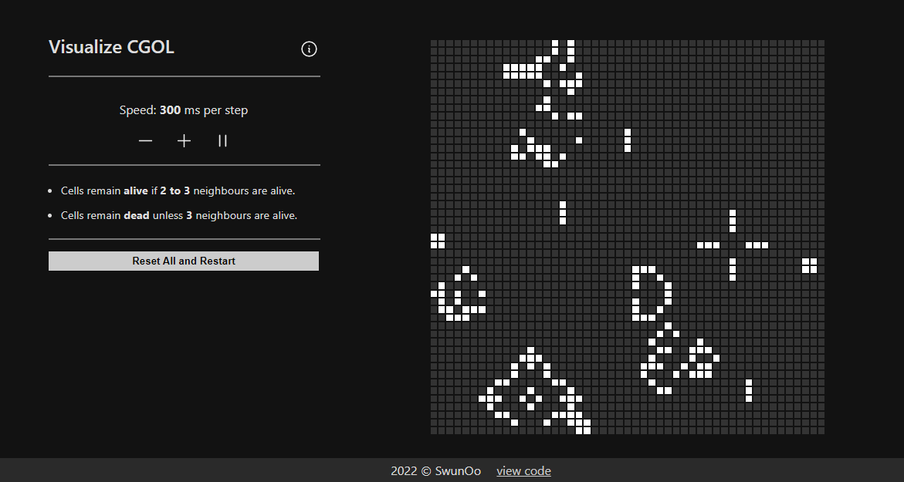

# Visualization of "Conway's Game of Life"

<a href="https://conway-game-of-life-renderer.vercel.app/">Demo Link</a>

<ul>
    <li> This is for visualizing Conway's Game of Life (aka, zero-person-game). </li>
    <h3>The Game</h3>
    <li> Basically, there is a grid with cells, each of which can be either ALIVE/ON or DEAD/OFF at any moment.</li>
    <li> The game then plays itself in such a way that each cell is determined to be ALIVE or DEAD next turn by calculating the number of its ALIVE neighbours. </li>
    <li>For more information, here is <a href="https://en.wikipedia.org/wiki/Conway%27s_Game_of_Life">a link to its wikipedia article</a></li>
</ul>
<ul>
    <h3>The App</h3>
    <li>With this app, we can specify the size of the grid, customize the initial condition of cells, and also tweak the original formula.</li>
    <li>While the game is in progress, we can increase/decrease speed and play/pause the game.</li>
    <li>There is no mechanism for recording the patterns yet.</li>
    <h3>The Project</h3>
    <li>I wrote this while learning TypeScript and React.</li>
    <li>It was written in a day, with around 10 hours of development time.</li>
    <li>Code refactoring and documentation are yet to be done.</li>
    <li>Please feel free to <a href="github.com/swunoo/ConwayGameOfLife-Renderer">view current code</a>. Thank you.</li>
</ul>
